

  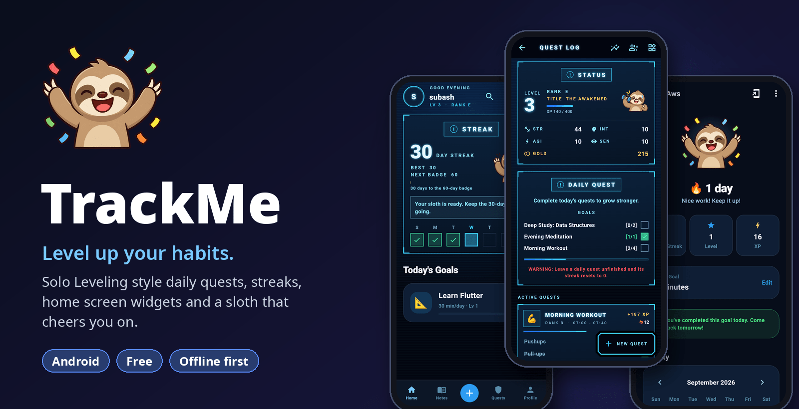

  
  
  

<h3 align="center">Turn your daily habits into quests. Level up for real.</h3>

TrackMe is a habit and learning tracker that plays like an RPG. 
Clear daily quests, grow your streak, earn XP and gold, rank up from E to S, 
and keep a sloth buddy happy right from your home screen.

  <a href="https://github.com/subasmk/Trackme/releases/latest"><b>⬇️ Download the APK</b></a>

---

## ⚔️ Daily quests, Solo Leveling style

Your habits become quests in glowing system windows. Every quest has a rank, a time window and sub-tasks like reps, minutes or distance. Finish them all and the quest is **CLEARED**. Skip it and the system warns you: your streak resets to 0.

<table>
  <tr>
    <td align="center">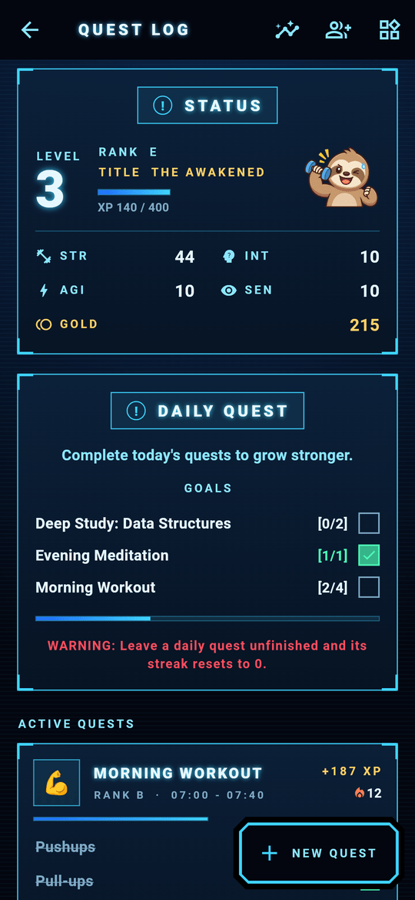 <b>Quest Log</b> - level, rank, title and stats</td>
    <td align="center">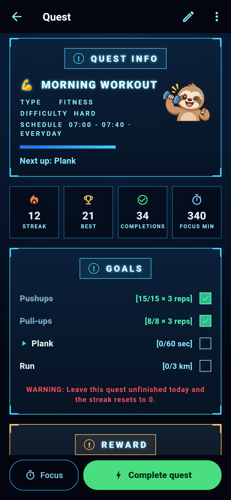 <b>Quest info</b> - sub-tasks with live progress</td>
    <td align="center">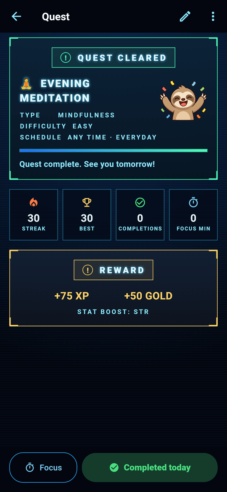 <b>Quest cleared</b> - claim your XP and gold</td>
  </tr>
</table>

- **Level up your character.** Earn XP and gold, raise STR, INT, AGI and SEN, and climb from Rank E upward.
- **Start fast with templates** like Morning Workout or Deep Study, or build your own with type, difficulty, time window and days.
- **Focus timer** built in, for 15, 25 or 45 minute sessions.
- **Quest stats** show your last 7 days, a 28-day heatmap and completion rate per quest.
- **Share a quest with a friend** using a simple code.
- **Reminders** before each quest, plus an evening nudge if your streak is at risk.

<table>
  <tr>
    <td align="center">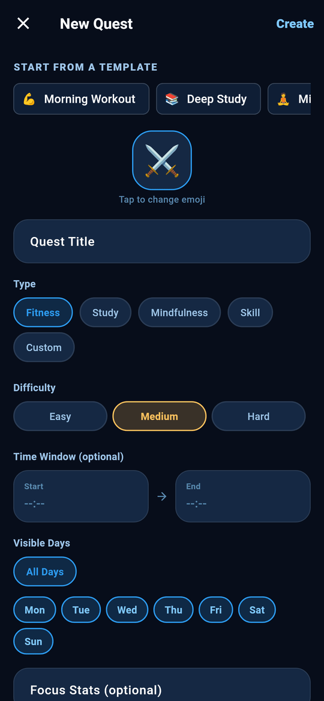 <b>New quest</b> - templates, type, difficulty</td>
    <td align="center">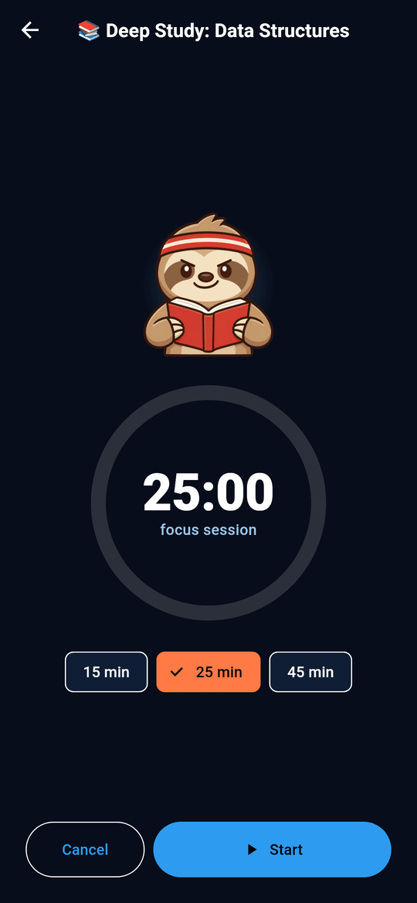 <b>Focus timer</b></td>
    <td align="center">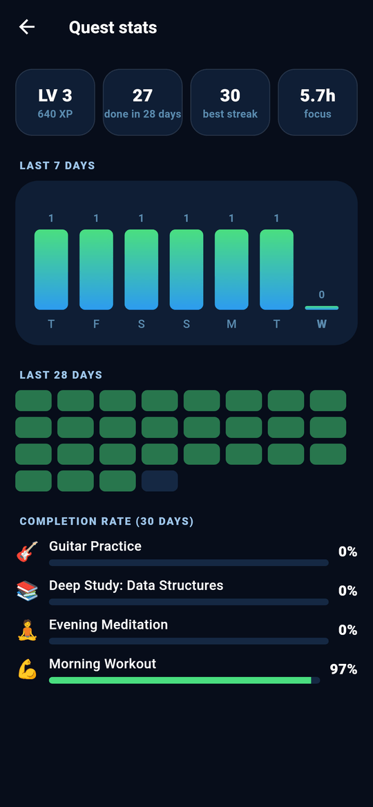 <b>Quest stats</b></td>
  </tr>
</table>

## 🔥 Streaks that keep you coming back

Set learning goals (AWS, DSA, Flutter, anything), check in once a day and write down what you learned. Your streak, best streak, level and XP grow with every day you show up.

<table>
  <tr>
    <td align="center">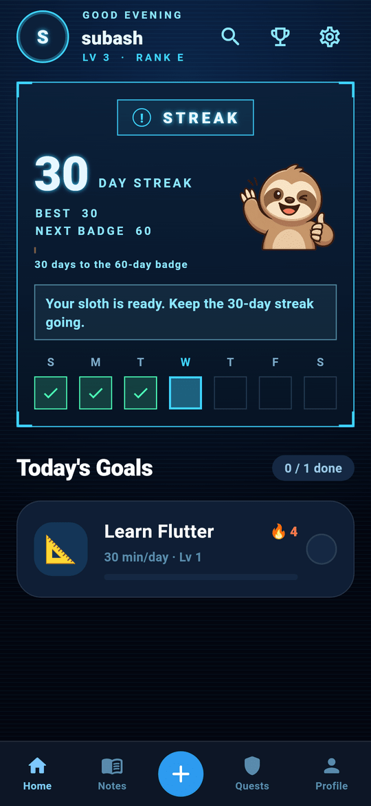 <b>Home</b> - your streak and today's goals</td>
    <td align="center">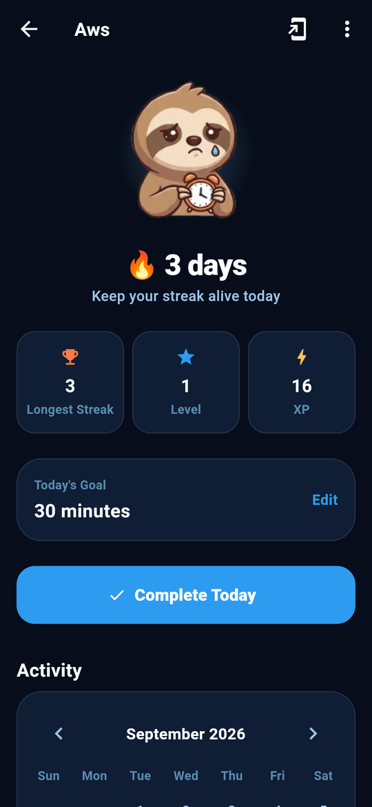 <b>Goal</b> - one tap to complete today</td>
    <td align="center">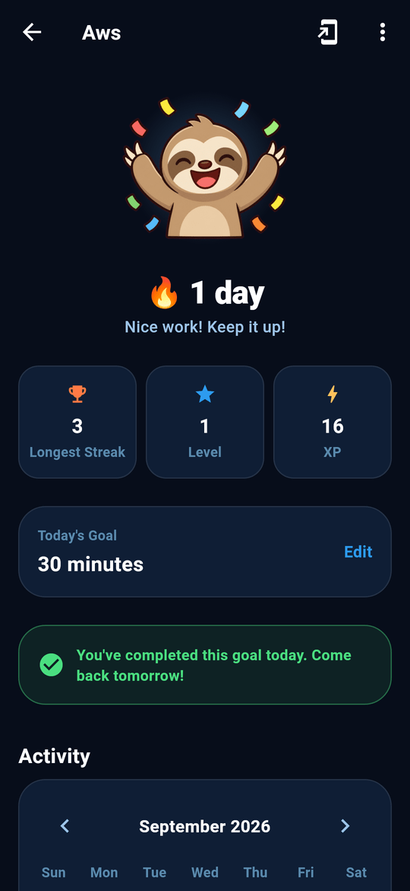 <b>Done!</b> - your sloth celebrates with you</td>
  </tr>
</table>

## 🦥 Meet your sloth

Your sloth reacts to how you're doing. It cheers when you finish, waves when a goal is still open, gets worried in the evening, and falls asleep late at night. Hit a 7-day streak and it grabs the trophy.

  

## 📱 Home screen widgets

Tick off quest sub-tasks without opening the app. The streak widget shows your week at a glance and comes in several colors. Add them from the app with one tap, or from your launcher's widget list.

  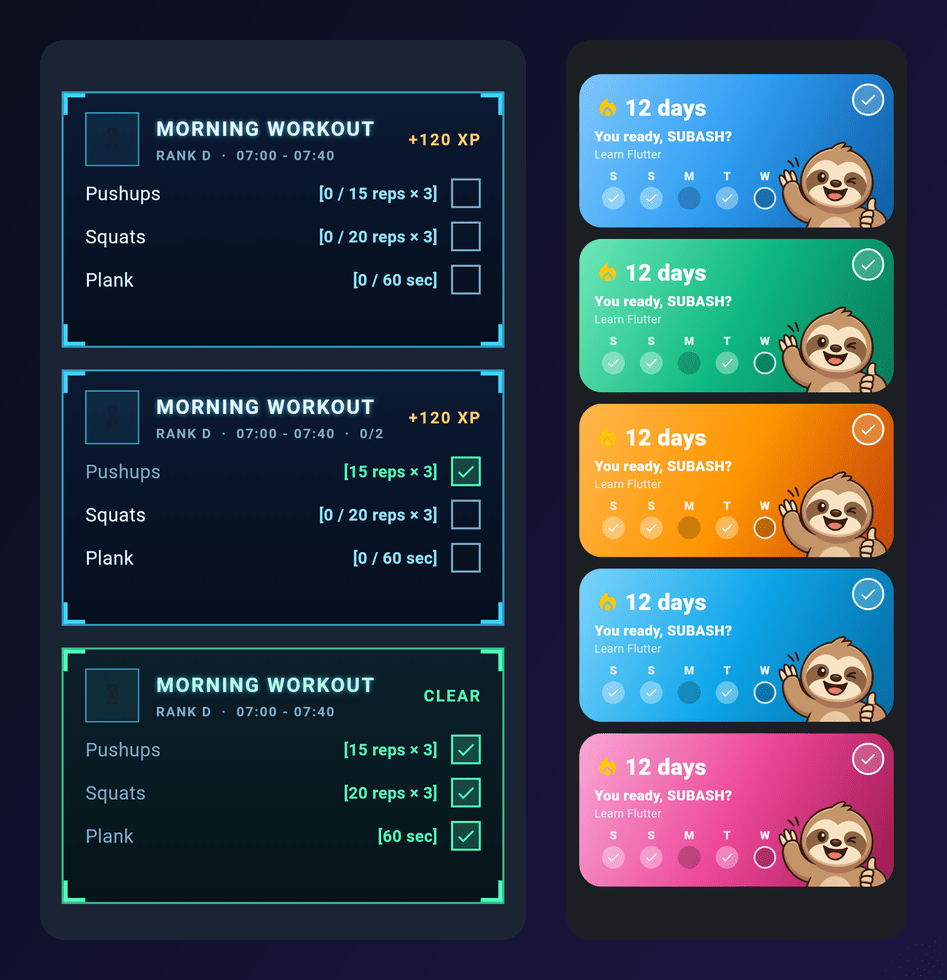

## 👥 Friends and profile

Pick a unique username and add a photo, then find friends by username, send requests and see each other's level and streak. Your profile shows your quests, focus split, activity and reputation.

<table>
  <tr>
    <td align="center">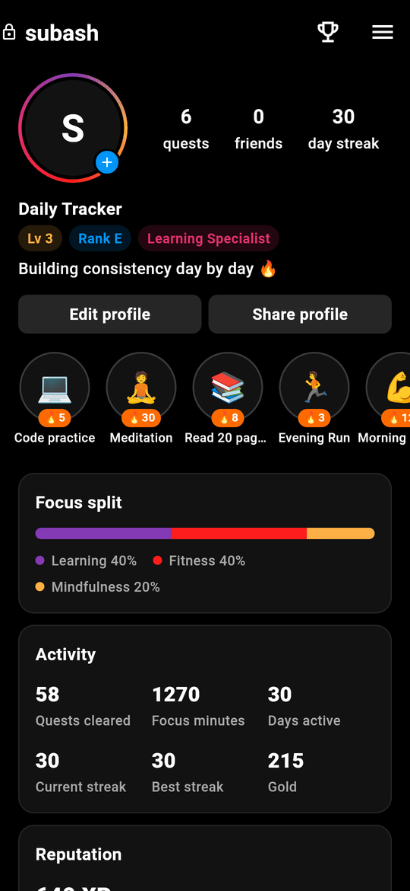 <b>Profile</b></td>
    <td align="center">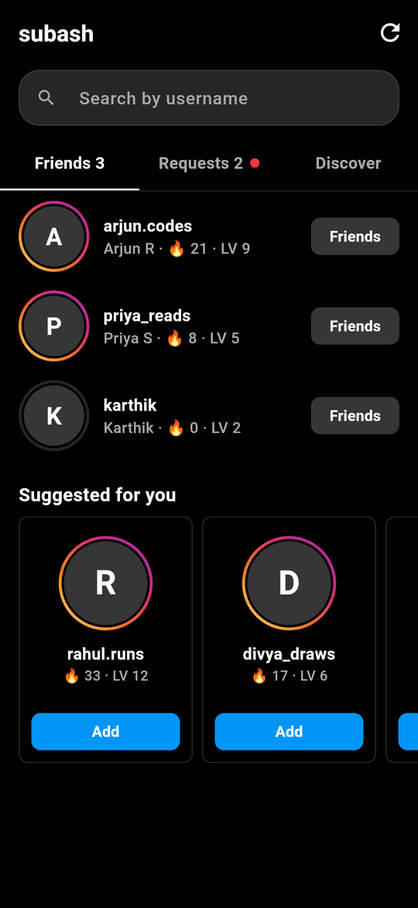 <b>Friends</b> - search, requests, suggestions</td>
    <td align="center">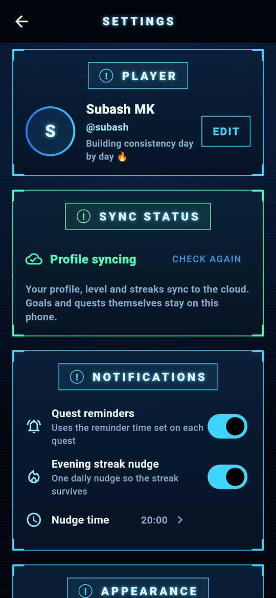 <b>Settings</b> - sync, reminders, themes</td>
  </tr>
</table>

## ✨ Also inside

- 🌙 Dark "system" look throughout
- 🔒 Your goals and quests are saved on your phone and work offline. Your profile syncs to the cloud so friends can find you.
- 👤 More than one account on the same phone, each with its own data
- 💾 Export and restore backups
- 🖼️ Custom background photo and widget colors
- 🏆 Achievements and badges

## ⬇️ Get TrackMe

1. Open the [latest release](https://github.com/subasmk/Trackme/releases/latest).
2. Download **app-arm64-v8a-release.apk**. It works on almost every modern Android phone.
3. Open the file and allow installing from this source if Android asks.

Older 32-bit phone? Use <code>app-armeabi-v7a-release.apk</code> instead.

## 🛠️ Built with

Flutter · Hive (on-device storage) · Supabase (accounts and profiles) · native Android home screen widgets

---

  Found a bug or have an idea? <a href="https://github.com/subasmk/Trackme/issues">Open an issue</a>. 
  If TrackMe helps you stay consistent, give the repo a ⭐

